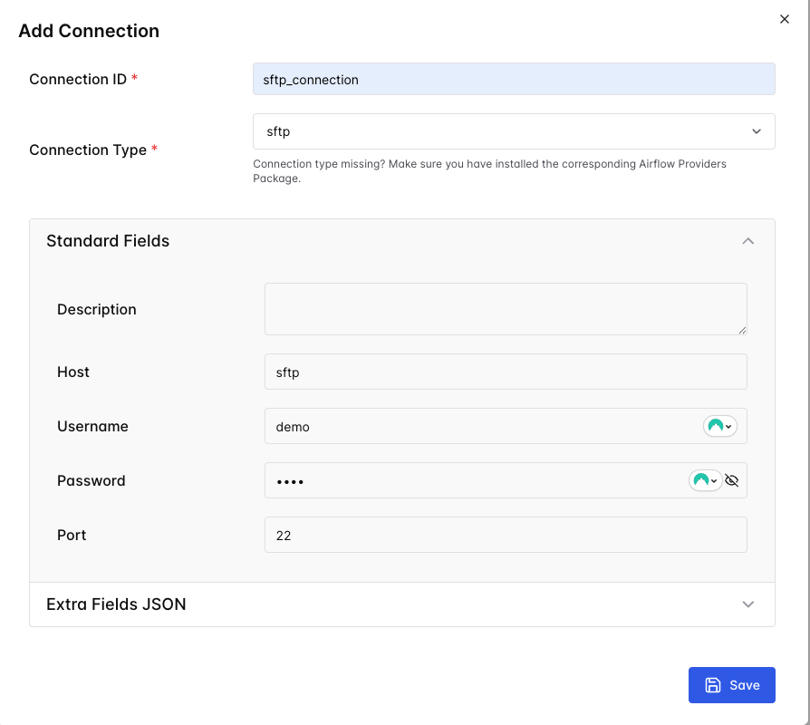
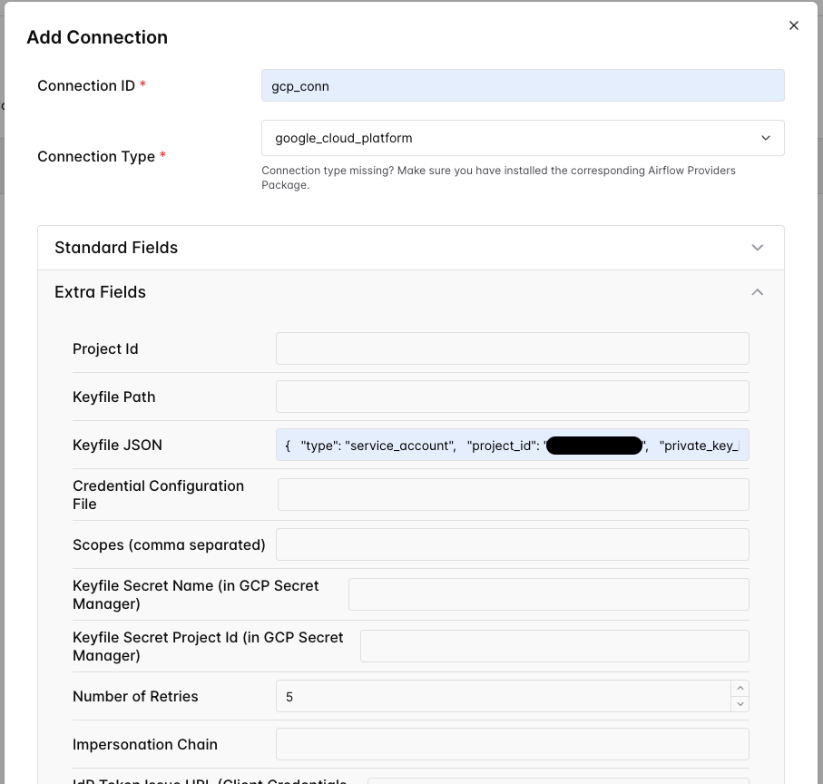

# Example Use case  : Ingest


## Setup Airflow
### Prerequisite

- Create data_set in bigquery
- Create bucket in GCS
- Add sftp connection
    

- Add gcp connection
    


## Ingestion Pipeline Design and Planning
**Prompt**
```
ช่วยออกแบบ pipeline ใน airflow สำหรับงาน ingest ข้อมูลของการซื้อขายแบบหุ้นแบบ end of day จาก SFTP  โดยจะโหลดไฟล์ csv จาก SFTP มาไว้ที่ GCS ก่อนแล้วค่อยโหลดเข้า BigQuery
```


## Generate Schema Validator
**Prompt**
```
ต่อไปอยากได้ task ตรวจเช็ค scheme ของข้อมูลก่อนที่จะทำการอัพโหลดจาก GCS ไปที่ bigquery  โดยใช้ pythonOperator  
scheme ของไฟล์ csv มีตามนี้
type_of_order STRING
order_no STRING
account_no STRING
sec_symbol STRING
trading_datetime DATETIME
trading_unit NUMERIC
trading_price NUMERIC
trading_amt NUMERIC
```

## Data Quality Gates Design
**Prompt**
```
ต่อไปช่วยเขียน task ช่วยออกแบบ Data Quality Gates ให้หน่อย จาก schema
โดยมี business rule:
1. ทุก column ห้ามมีค่า NULL หรือค่าว่าง
2. type_of_order มีได้แค่ มีแค่ BUY หรือ SELL
3. order_no ห้ามมี duplicates
4. trading_datetime ต้องเป็น format 2025-06-01 09:01:38
5. trading_amt = trading_unit * trading_price

และมีอะไรที่ควรเช็คเพิ่มอีกไหม
```

## Generate Document
**Prompt**
```
ช่วยทำ document ของ dags นี้ให้หน่อย โดยให้เป็น format markdown
```